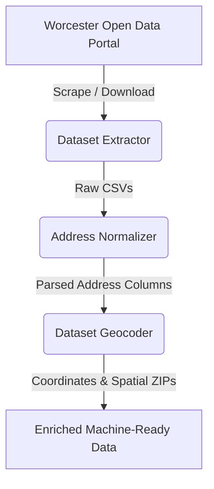

# C4W-Dataset-Preprocess (Business Growth Predictor Pipeline)

Welcome to the data preprocessing pipeline for the Code for Worcester (C4W) Business Growth Predictor project. The core objective of this project is to harvest, standardize, and geometrically enrich public datasets from the City of Worcester's open data catalog so they can be reliably used in rigorous downstream spatial analysis and machine learning models.

Public civic data is often messy, unstructured, and lacks exact spatial coordinates. This pipeline aims to cure those pain points by providing an automated workflow from raw data ingestion to ready-to-map geographic outputs.

## High-Level Architecture & Workflow

This project is logically divided into three primary sequential sub-projects, each handling a distinct phase of the data refinement lifecycle.



### 1. Dataset Extractor (`dataset_extractor/`)
**Purpose:** Automated ingestion and retrieval of raw civic data.
- Connects to the Worcester data catalog to index available CSVs.
- Provides a clean, searchable web-based UI (`index.html`) to group datasets by publisher and selectively bulk-download them to local storage.
- Acts as the initial entry point, pulling raw files down into the `data/raw/` directory.

### 2. Address Normalizer (`address_normalizer/`)
**Purpose:** Structuring and cleaning human-entered text strings.
- Public datasets often cram entire locations into a single `Address` column (e.g., "123 Main St Apt 4").
- The normalizer applies a deterministic, priority-ordered parsing pipeline to extract semantic components such as `street_number`, `street_name`, and `unit`.
- Outputs an intermediate CSV where the unified text is split into clean, standardized columns, paving the way for accurate geocoding.

### 3. Dataset Geocoder (`dataset_geocoder/`)
**Purpose:** Converting physical text addresses into actionable spatial coordinates.
- Processes the cleanly parsed columns from the normalizer against a localized, high-throughput Nominatim instance.
- Appends precise `latitude` and `longitude` coordinate fields to each row.
- Follows up with a spatial join against Massachusetts ZCTA (Zip Code Tabulation Area) shapefiles using `geopandas` to retroactively calculate the most accurate geographic `zcta_zip` for every point.

## Project Execution Map

The sequence of tools can be orchestrated directly via the root `Makefile` (which relies on `uv` to maintain the virtual environment seamlessly).

```bash
# 1. Start the Dataset Extractor UI to fetch raw data
make run-extract

# 2. Normalize a specific raw dataset
make run-norm CSV="Building_Permits.csv"

# 3. Geocode the normalized dataset
make run-geo CSV="Normalized_Building_Permits.csv"
```

## Contributing & Development

This repository relies on modern tooling managed in `pyproject.toml`.
- **Environment Management:** Powered by `uv`.
- **Linting & Formatting:** Enforced via `ruff`.
- **Type Checking:** Validated via `mypy`.

For detailed, deep-dive usage instructions on each specific component (including internal class architecture and CLI parameters), please refer to the individual `README.md` files located at the root of `dataset_extractor/`, `address_normalizer/`, and `dataset_geocoder/`.
